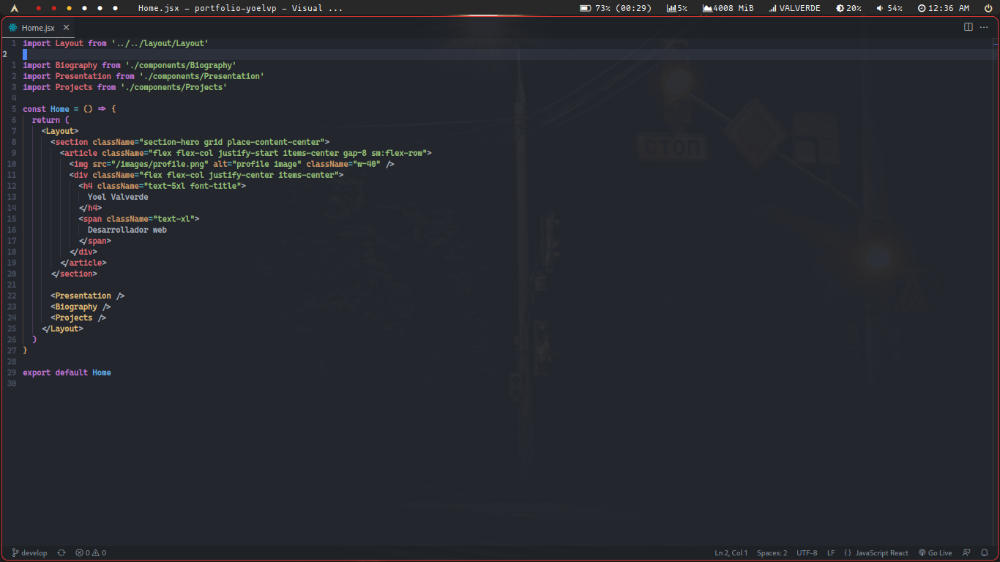
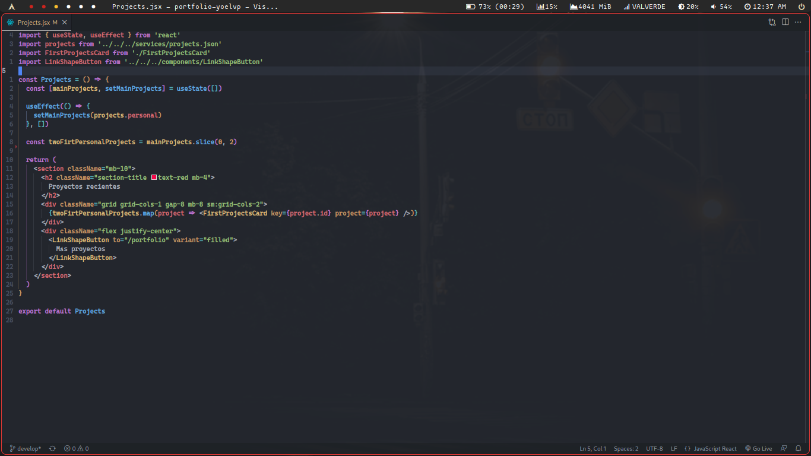
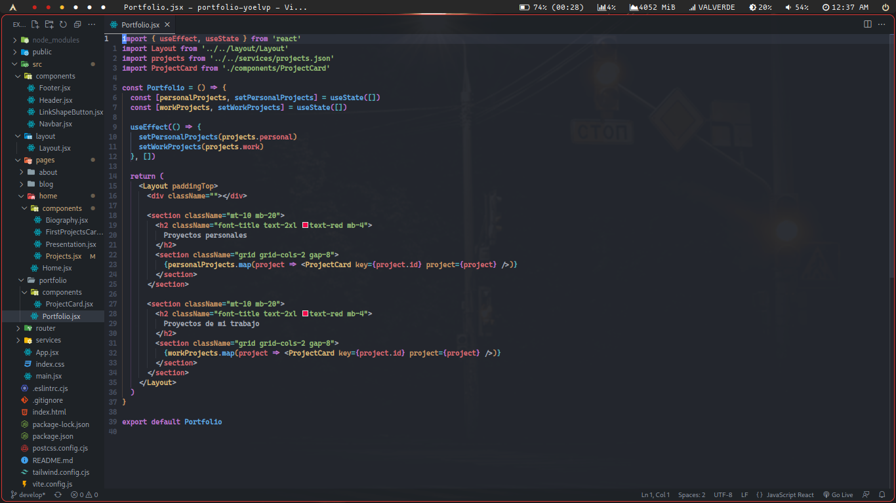

# Yoel Valver - Portafolio
Mi portafolio personal

## Screenshot





## Stack
- **[React](https://reactjs.org):** React es una biblioteca JavaScript de código abierto para construir interfaces de usuario.
- **[Tailwindcss](https://tailwindcss.com):** Tailwind CSS es una biblioteca de hojas de estilo en cascada (CSS) que se utiliza para crear diseños rápidos y personalizados para aplicaciones web.
- **[React Router Dom](https://reactrouter.com/en/main):** React Router DOM es una biblioteca de enrutamiento para aplicaciones React que se utiliza para manejar la navegación y la gestión de URL en aplicaciones web.

## Estructura
```
| # Pages
|--- Pages
|------ Name page
| # React components
|--- Componentes
| # Layout component
|--- Layout
| # Routes
|--- # Routing
| # Data
|--- # Services
```