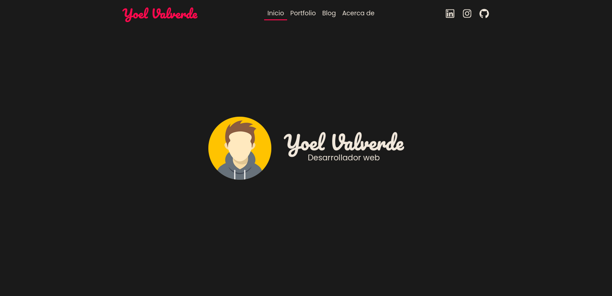

# Yoel Valver - Portafolio
Mi portafolio personal

## Screenshot



## Stack
- **[React](https://reactjs.org):** React es una biblioteca JavaScript de código abierto para construir interfaces de usuario.
- **[Tailwindcss](https://tailwindcss.com):** Tailwind CSS es una biblioteca de hojas de estilo en cascada (CSS) que se utiliza para crear diseños rápidos y personalizados para aplicaciones web.
- **[React Router Dom](https://reactrouter.com/en/main):** React Router DOM es una biblioteca de enrutamiento para aplicaciones React que se utiliza para manejar la navegación y la gestión de URL en aplicaciones web.


## Characteristics
- **Home:** main page where I introduce myself and share a bit of my experience and journey, I also show my most recent projects.
- **Portfolio:** tab where I show the list of my projects, both personal projects and projects I did for different companies.


## Structure
```
| # Pages
|--- Pages
|------ Name page
| # React components
|--- Componentes
| # Layout component
|--- Layout
| # Routes
|--- # Routing
| # Data
|--- # Services
```


## Lisence
MIT Lisence

You can use my project, as long as you meet the following conditions:
- Add link to my portfolio

Check out [LISENCE](./LICENSE)


function dedupe(list) {
  const uniqueIds = new Set();
  const result = [];
  
  for (const item of list) {
    if (!uniqueIds.has(item.id)) {
      uniqueIds.add(item.id);
      result.push(item)
    } else {
      const existItem = result.find(i => i.id === item.id);
      Object.assign(existItem, item);
    }
  }
  
  return result;
}


function denormalize({ primary, related, relatedName, referenceId }) {
  const result = [];
  for (const item of primary) {
    const relatedItems = []
    
    for (const relatedItem of related) {
      if (relatedItem[referenceId] === item.id) {
        relatedItems.push(relatedItem)
      }
    }
    
    result.push({
      ...item,
      [relatedName]: relatedItems
    })
  }
  
  return result;
}

module.exports = denormalize;
